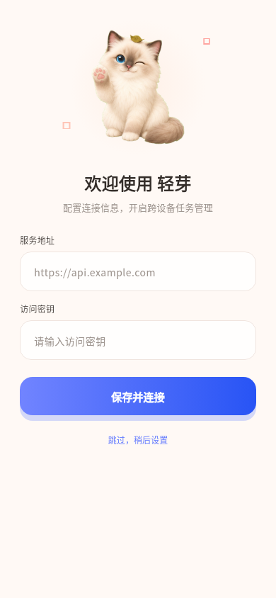
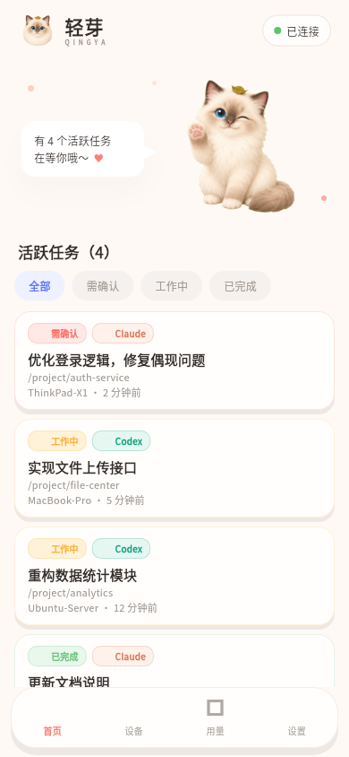
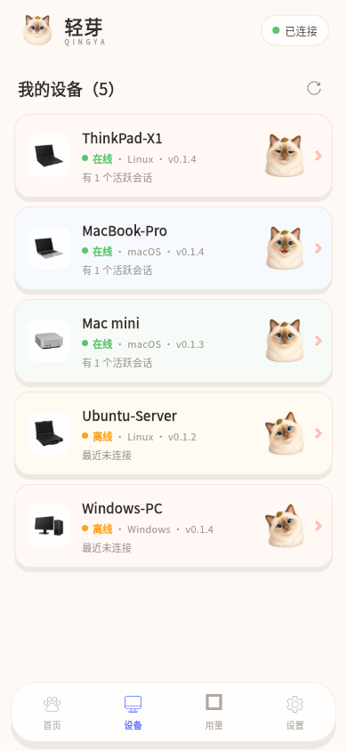
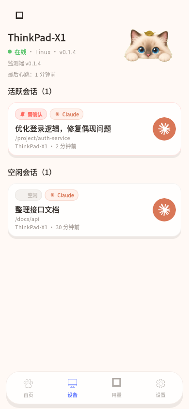
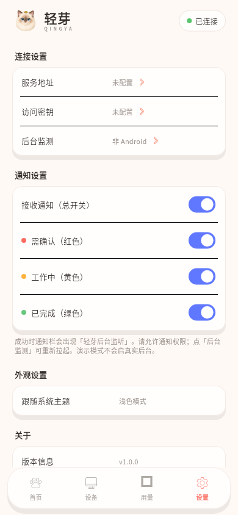

# agent-status

个人私有的多端 Agent 状态监控：监控端上报 Claude Code / Codex 会话状态，中心服务汇总，Android 只读查看并本地通知。

## 组件

| 组件 | 路径 | 说明 |
|------|------|------|
| 契约 | `docs/api.md`, `api/openapi.yaml` | REST + WebSocket |
| 服务端 | `cmd/server` | Go + SQLite |
| Mock | `cmd/mock` | 内存态联调 |
| 监控端 | `cmd/monitor` | Codex 扫描 + Claude hook + 上报 |
| 轻芽 App（Flutter） | `mobile/` | 只读客户端，对齐原型图 |
| 部署说明 | `docs/deploy.md` | 从零安装 |

## 轻芽界面预览

演示数据下的界面示意（Flutter golden 截图）：

| 欢迎 / 配置 | 首页任务 | 设备列表 |
|:---:|:---:|:---:|
|  |  |  |

| 设备详情 | 设置 |
|:---:|:---:|
|  |  |

## 最短路径

推荐用安装器（二进制 + 本机管理，**不走 Docker**）。仓库 Public 且有 Release 后：

```bash
# Linux
curl -fsSL https://raw.githubusercontent.com/ynlea/agent-status/main/scripts/install.sh | bash

# Windows PowerShell
# irm https://raw.githubusercontent.com/ynlea/agent-status/main/scripts/install.ps1 | iex
```

开发机本地编装：

```bash
export PATH="$HOME/.local/go/bin:$PATH"
./scripts/release-build.sh
./scripts/install.sh install --role all --key dev-secret \
  --server-url http://127.0.0.1:29125 --local-bin ./dist/release --yes
```

说明见 `docs/install.md`。手动 `go run` / Docker 见 `docs/deploy.md`。

Flutter 客户端：

```bash
export PATH="$HOME/flutter/bin:$PATH"
cd mobile && flutter pub get && flutter run
```

更多：`mobile/README.md`。

## 开发

```bash
go test ./...
go build -o bin/agent-status-server ./cmd/server
go build -o bin/agent-status-monitor ./cmd/monitor
GOOS=windows GOARCH=amd64 go build -o bin/agent-status-monitor.exe ./cmd/monitor
```

## 状态语义

- 红 `confirm`：需回本机确认  
- 黄 `working`：工作中  
- 绿 `done`：刚完成  
- 空 `idle`：无活跃任务  
